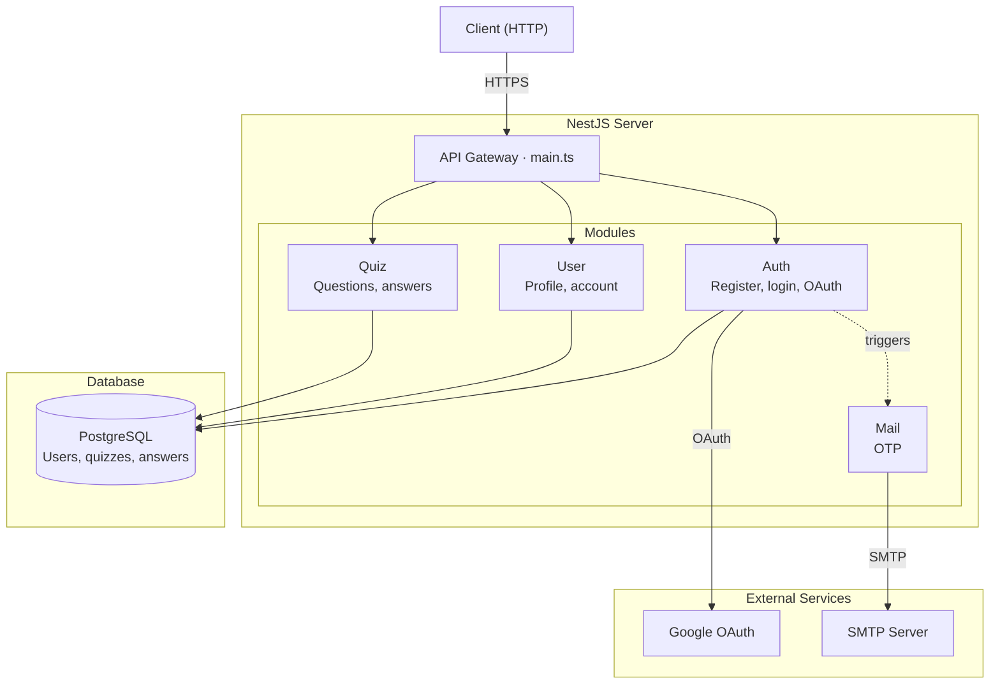
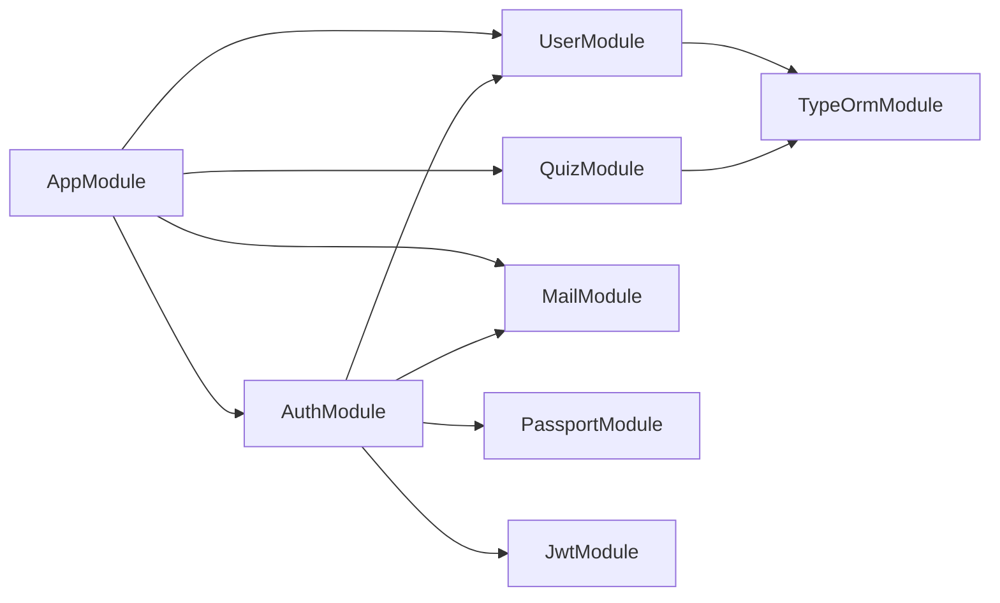
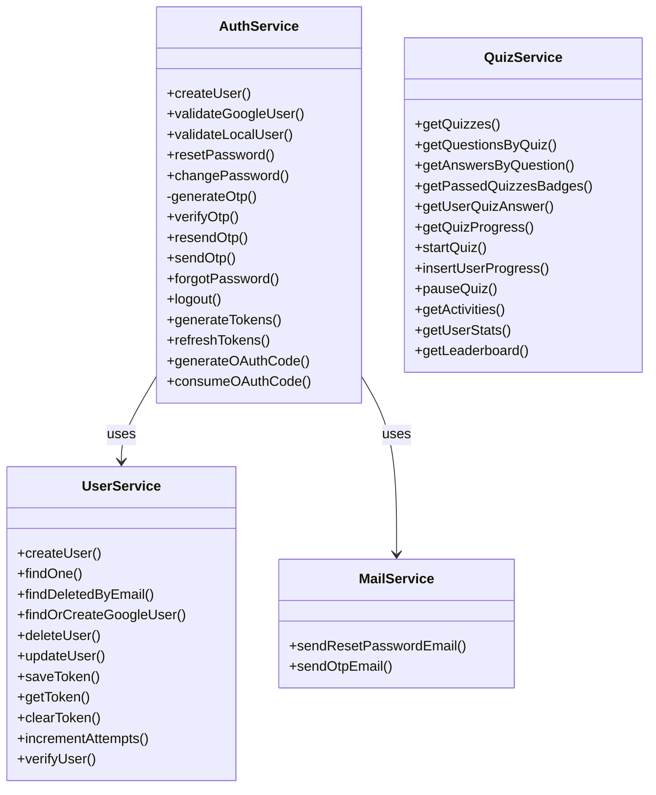
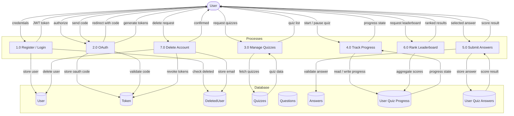
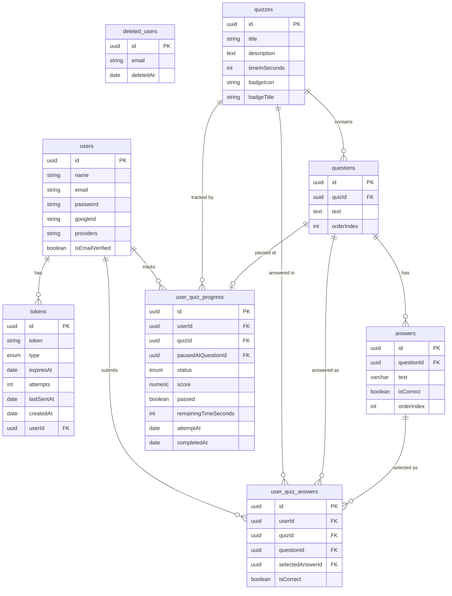

<h1 align="center" style="padding: 20px 0">🧠 Quizzer — Backend API ⏱️</h1>


> A scalable, production-ready REST API for the Quizzer platform, featuring secure JWT-based authentication, comprehensive quiz management, and a dynamic leaderboard system that enables users to evaluate their performance and engage in competitive gameplay

---

## Overview

**Quizzer** is a competitive quiz platform where users can register, take quizzes, and compete on a ranked leaderboard. This is a **backend API** built with NestJS, a progressive Node.js framework, providing a strongly-typed, modular architecture for handling authentication, quiz logic, scoring, and leaderboard ranking.

---

## Features

- 🔐 **JWT Authentication** — Secure user registration, login, and protected routes via JSON Web Tokens stored in cookies
- 📝 **Quiz Management** — Retrieve quizzes and questions with answers, and track user progress across the app
- ✅ **Answer Submission & Scoring** — Submit answers and receive instant calculated scores
- 🏆 **Leaderboard** — Ranked leaderboard tracking top-scoring users across the platform
- 🛡️ **Guards** — NestJS Guards enforce access control on sensitive endpoints
- 🧩 **Modular Architecture** — Clean separation of concerns using NestJS modules
- 🔒 **Security Hardened** — Protection against CSRF, SQL injection, rate limiting, HTTP security headers, and CORS enforcement

---

## Getting Started

### Prerequisites

Make sure you have the following installed:

- [Node.js](https://nodejs.org/) v18+
- [npm](https://www.npmjs.com/) or [yarn](https://yarnpkg.com/)
- A running database instance (PostgreSQL)

### Installation

1. **Clone the repository**

```bash
git clone https://github.com/Ahmed-Elgammal-900/Quiz-App-Back-End.git
cd Quiz-App-Back-End
```

2. **Install dependencies**

```bash
npm install
```

### Environment Variables

Create a `.env` file in the root directory:

```env
DATABASE_URL=database_connection_url
JWT_SECRET=jwt_secret
JWT_REFRESH_SECRET=jwt_refresh_secret
GOOGLE_CALLBACK_URL=google_callback_url (OAuth google auth)
GOOGLE_CLIENT_ID=google_client_id (OAuth google auth)
GOOGLE_CLIENT_SECRET=google_client_secret (OAuth google auth)
FRONT_END_ORIGIN= front_end_url
```

### Running the Server

**Development mode** (with hot reload):

```bash
npm run start:dev
```

**Production build:**

```bash
npm run build
npm run start:prod
```

The server will start at `http://localhost:3000` (or the port defined in your `.env`).

---

## 🧪 Testing

This project includes a comprehensive test suite built with **Jest**

### Running Test

**unit test & integration test**

```bash
npm run test
```

**e2e test**

```bash
npm run test:e2e
```

> 📌 note: `.env` file should exist with configured var for test success

---

## ⚙️ CI/CD

Automated pipeline configured with **GitHub Actions**

---

## Swagger Docs

you will find docs on `http://localhost:3000/docs` (or the port defined in your `.env`)

---

## API Endpoints

### Auth — `/auth`

| Method | Endpoint               | Description                                                  | Auth Required |
| ------ | ---------------------- | ------------------------------------------------------------ | ------------- |
| POST   | `/signup`              | Register a new user                                          | ❌            |
| POST   | `/login`               | Login and receive a token                                    | ❌            |
| GET    | `/google`              | redirect to google auth                                      | ❌            |
| GET    | `/google/callback`     | get google user info to login or signup                      | ❌            |
| GET    | `/exchange`            | exchange oauth code with session tokens                      | ❌            |
| POST   | `/refresh-token`       | rotate access_token and refresh_token                        | ✅            |
| PATCH  | `/change-password`     | change user password                                         | ✅            |
| POST   | `/forget-password`     | request a change for a user password by email                | ❌            |
| POST   | `/reset-password`      | recieve new password with token to change forgotton password | ❌            |
| POST   | `/verify-email`        | verify user email by otp                                     | ❌            |
| POST   | `/resend-otp`          | resend otp for a user on email                               | ❌            |
| POST   | `/verify-access-token` | verify access token                                          | ✅            |
| POST   | `/logout`              | logout user and remove cookie tokens                         | ✅            |

### User — `/user`

| Method | Endpoint | Description                                            | Auth Required |
| ------ | -------- | ------------------------------------------------------ | ------------- |
| GET    | `/`      | retrieve the authenticated user's profile information. | ✅            |
| DELETE | `/`      | delete A user from system and remove cookie tokens     | ✅            |

### Quizzes — `/quizzes`

| Method | Endpoint                          | Description                                                     | Auth Required |
| ------ | --------------------------------- | --------------------------------------------------------------- | ------------- |
| GET    | `/`                               | Get all quizzes with user progress if exist                     | ✅            |
| GET    | `/activities`                     | Retrieves all active quiz activities for the authenticated user | ✅            |
| GET    | `/stats`                          | Get the user stats in the platform                              | ✅            |
| GET    | `/leaderboard`                    | Get leaderboard and ranked users                                | ✅            |
| GET    | `/passed`                         | Get passed quizzes id with badges for the user                  | ✅            |
| GET    | `/questions/:questionId/answers`  | Get the choices of the question                                 | ✅            |
| GET    | `/questions/:questionId/answered` | Get user answer for the question                                | ✅            |
| GET    | `/:quizId/questions`              | Get a questions of the quiz                                     | ✅            |
| GET    | `/:quizId/progress`               | Get progress of specific quiz                                   | ✅            |
| POST   | `/:quizId/start`                  | Begin the quiz                                                  | ✅            |
| POST   | `/:quizId/pause`                  | Pause the started quiz                                          | ✅            |
| POST   | `/:quizId/progress`               | Insert user progress                                            | ✅            |

> 📌 All protected routes require an `cookies token` .

---

## Project Structure

```text
src
├── common
│   ├── decorators
│   │   ├── match.decorator.ts
│   │   ├── public.decorator.ts
│   │   └── user.decorator.ts
│   ├── filters
│   │   └── global-exception.filter.ts
│   ├── guards
│   │   └── jwt-auth.guard.ts
│   └── interceptors
│       ├── logging.interceptor.ts
│       └── transform-response.interceptor.ts
├── config
│   └── db-connectiont.ts
├── modules
│   ├── auth
│   │   ├── constants
│   │   │   ├── auth.constants.ts
│   │   │   └── token-type.constant.ts
│   │   ├── dto
│   │   │   ├── change-password.dto.ts
│   │   │   ├── exchange-query.dto.ts
│   │   │   ├── forget-password.dto.ts
│   │   │   ├── google-auth.dto.ts
│   │   │   ├── login.dto.ts
│   │   │   ├── otp.dto.ts
│   │   │   ├── resend-otp.dto.ts
│   │   │   ├── reset-password.dto.ts
│   │   │   └── signup.dto.ts
│   │   ├── strategies
│   │   │   ├── googleAuth.strategy.ts
│   │   │   ├── jwt.strategy.ts
│   │   │   └── jwtRefresh.strategy.ts
│   │   ├── types
│   │   │   └── response-types.ts
│   │   ├── auth.controller.spec.ts
│   │   ├── auth.controller.ts
│   │   ├── auth.module.ts
│   │   ├── auth.service.spec.ts
│   │   └── auth.service.ts
│   ├── mail
│   │   ├── templates
│   │   │   ├── email-verification.tsx
│   │   │   └── reset-password.tsx
│   │   ├── mail.module.ts
│   │   ├── mail.service.spec.ts
│   │   └── mail.service.ts
│   ├── quiz
│   │   ├── constants
│   │   │   └── quiz-progress-status.ts
│   │   ├── dto
│   │   │   ├── insert-progress.dto.ts
│   │   │   ├── pagination.dto.ts
│   │   │   └── pause-quiz.dto.ts
│   │   ├── entities
│   │   │   ├── answer.entity.ts
│   │   │   ├── question.entity.ts
│   │   │   ├── quiz.entity.ts
│   │   │   ├── user-progress.entity.ts
│   │   │   └── user-quiz-answer.entity.ts
│   │   ├── types
│   │   │   └── quiz.types.ts
│   │   ├── quiz.controller.spec.ts
│   │   ├── quiz.controller.ts
│   │   ├── quiz.module.ts
│   │   ├── quiz.service.spec.ts
│   │   └── quiz.service.ts
│   └── user
│       ├── constants
│       │   └── provider.constant.ts
│       ├── dto
│       │   └── user-response.dto.ts
│       ├── entities
│       │   ├── deletedUser.entity.ts
│       │   ├── token.entity.ts
│       │   └── user.entity.ts
│       ├── user.controller.spec.ts
│       ├── user.controller.ts
│       ├── user.module.ts
│       ├── user.service.spec.ts
│       └── user.service.ts
├── utils
│   └── clear-cookie.ts
├── app.controller.ts
├── app.module.ts
└── main.ts
```

---

## 🏗️ System Architecture

This section outlines the backend architecture of Quizzer, broken down into five diagrams: a high-level overview, module dependency graph, service class diagram, data flow diagram, and database schema.

---

### High-level Overview

A bird's-eye view of how the client interacts with the API and how each module connects to the database.



---

### Module Breakdown

The internal NestJS module dependency graph, showing how modules import and depend on each other.



---

### Services Class Diagram

A breakdown of each service's public interface and how services depend on one another. `+` denotes public methods, `-` denotes private methods.



---

### Data Flow Diagram

Shows how data moves through the system between users, processes, and the database.



---

### 🗄️ Database Schema

The following diagram represents the relational structure of the Quizzer database, including user authentication, quiz management, progress tracking, and answer submission.



---

## 📄 License

MIT License

---

<div align="center">
  Built with ❤️ by <a href="https://github.com/Ahmed-Elgammal-900">Ahmed Elgammal</a>
</div>
